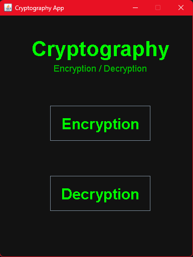
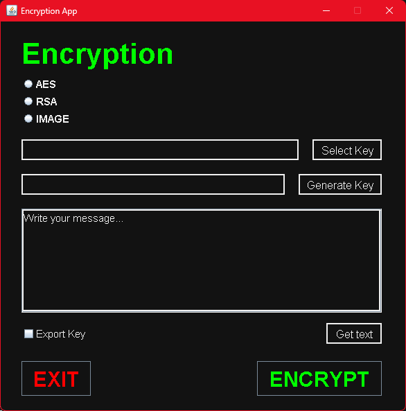
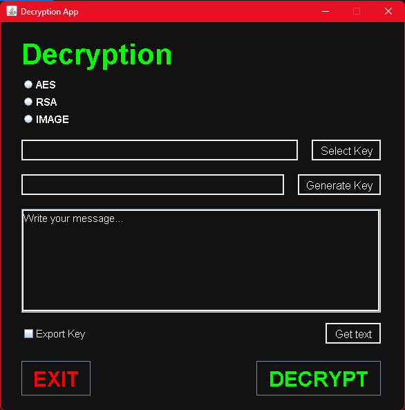

# Cryptography Project v.2.0

### Description
This project can **encrypt** and **decrypt** message and image file (with extension: .txt).

It uses **two different methods** of encryptio / decryption witch are **RSA** and **AES**, plus one specific for **images** that derives from AES.

>#### RSA
>RSA (Rivest-Shamir-Adleman) algorithm is an **asymmetric cryptography algorithm**. Asymmetric means that it **works on two different keys**. _Public Key_ and _Private Key_. As the name describes the Public Key is given to everyone and the Private key is kept private.
>
>An example of asymmetric cryptography: 
>
>1. A client (for example browser) sends its public key to the server and requests some data.
>2. The server encrypts the data using the client’s public key and sends the encrypted data.
>3. The client receives this data and decrypts it.
>
>Since this is asymmetric, nobody else except the browser can decrypt the data even if a third party has the public key of the browser.

>#### AES
>The Advanced Encryption Standard (AES) is a **symmetric block cipher** chosen by the U.S. government to protect classified information.
>
>Today, AES is one of the most popular symmetric key cryptography algorithms for a wide range of encryption applications for both government and commercial use.
>
>- Electronic communication apps.
>- Programming libraries.
>- Internet browsers.
>- File and disk compression.
>- Wireless networks.
>- Databases.

## Installation
There are several methods to install it.

1. Go to the URL of the page. Change **github.com** with **github.dev**. This way you will use **VS Code web**.

2. Download the project and the **Java compiler** from browser. You install a **Java IDE**(programming environment) and run it. 
Example of Java IDE:
    * [Eclipse](https://www.eclipse.org/eclipseide/)
    * [IntelliJ](https://www.jetbrains.com/idea/)
    * [NetBeans](https://netbeans.apache.org/)
    * [Visual Studio Code](https://code.visualstudio.com/)

## Usage
How to use this project correctly.

This project provides the encryption and decryption of **messages** or **image** files. 
It has two encryption methods (RSA, AES) with their respective keys.

To make it work correctly you need to decide whether you want to **encrypt** or **decrypt** button from the main gui.

Then decide on the **encryption algorithm.**
If you have chosen AES you must enter the **Secret Key** and **IV**, whereas if you have chosen RSA write the **Public Key to encrypt** for first and the **Private Key to decrypt** for second.

    
    

For **import** a text file contains **keys**, you have to press **"Select Key"** button,
then an interface will appear where you can select the file.
Instead to import a file containing a message, you have to press **"Get text"** button and you can choose the correct file.

You can **generate keys** based on the encryption method you choose.

You can also **Export Keys** on a file (.txt).

---

### WARNING
* **Don't change the files** that are **generated by the program**, to avoid unpleasant problems
* Enter the data in order, **from top to bottom**. This way the app will give you **suggestions on the fields to enter**.
* If you choose the **RSA** method you will only be able to encrypt **messages shorter** than **117 characters**.
* For the **Image encryption** you will have to enter the **image path**.
* For the **Image decryption** you will have to enter the **text that was encrypted** for you (that file .txt contains a lot of characters).

---

### NEWS
In this new version of my first project in Java Swing, I added and fixed more thingh.

#### New Features
* Image Encryption
* New interface layout
* Made more user friendly

#### Bugs Fixed
* Text area scroll bar
* Improved encryption key control

---

## Credits
This project was **created by me**. 
I took inspiration from videos on YouTube to implement the encryption.

For RSA i used a tutorial by [WhiteBatCodes](https://youtu.be/R9eerqP78PE?si=1epeC5rTr1-xWqvA) 
For AES i used a tutorial by [WhiteBatCodes](https://youtube.com/playlist?list=PLtgomJ95NvbPDMQClkBZPijLdEFyo0VHa&si=LJBLCXXmUtNLXQ4X) 
For Image Encryption with AES methods i used a tutorial by [Coding Tech Room](https://youtu.be/Nq09duWC7LA?si=wzbqlMnVW-NHqZaC)

#### GitHub: [tommy-210](https://github.com/tommy-210).