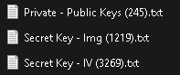

# WIKI

This is the documentation for my encryption project.

## What is Cryptography?

Cryptography is the **process of hiding or coding information** so that only the person a message was intended for can read it.
The art of cryptography has been used to code messages for thousands of years and continues to be used in bank cards, computer passwords, and ecommerce.

This **cybersecurity practice**, also known as cryptology, combines various disciplines like `computer science, engineering, and mathematics` to create complex codes that hide the true meaning of a message.

Cryptography can be traced all the way back to **ancient Egyptian hieroglyphics** but remains vital to **securing communication and information** in transit and preventing it from being read by untrusted parties.

### Integrity

Similar to how cryptography can **confirm the authenticity of a message**, it can also prove the integrity of the information being sent and received. Cryptography ensures information is **not altered** while in storage or during transit between the sender and the intended recipient.

### Types of Cryptographic Algorithms
---
There are many types of cryptographic algorithms available. They vary in complexity and security, depending on the type of communication and the sensitivity of the information being shared.

>### AES
>---
>The Advanced Encryption Standard (AES) is a **symmetric block cipher** chosen by the U.S. government to protect classified information.
>
>Today, AES is one of the most popular symmetric key cryptography algorithms for a wide range of encryption applications for both government and commercial use.
>
>- Electronic communication apps.
>- Programming libraries.
>- Internet browsers.
>- File and disk compression.
>- Wireless networks.
>- Databases.

>### RSA
>---
>RSA (Rivest-Shamir-Adleman) algorithm is an **asymmetric cryptography algorithm**. Asymmetric means that it **works on two different keys**. _Public Key_ and _Private Key_. As the name describes the Public Key is given to everyone and the Private key is kept private.
>
>An example of asymmetric cryptography: 
>
>1. A client (for example browser) sends its public key to the server and requests some data.
>2. The server encrypts the data using the client’s public key and sends the encrypted data.
>3. The client receives this data and decrypts it.
>
>Since this is asymmetric, nobody else except the browser can decrypt the data even if a third party has the public key of the browser.

## How it works?

When you generate and export keys, the program create a file (.txt) named:

| RSA | AES | Image |
| :----------------: | :---------------: | :--------------: |
| Private - Public Key | Secret Key - IV | Secret Key - image |

 

This file contains keys, for example AES:
>R8xmcAxBz//eKROHfrby6A==  
>2IYi3RlRZK9psQd2

First line is for Secret Key and second line is for IV

## Usage
You can use this project to encrypt and decrypt messages, images and texts as you like.

>### For AES
>Allows you to encrypt your text messages using AES, using `symmetric encryption keys`.
>>#### Encryption:
>>1. **Select AES** as method of encryption.
>>2. **Generate Key**, **select file** (.txt) contains key or **insert key in text field**.
>> In first text field write your Secret Key, and in second text field put your IV.
>>3. In text area **write your message**, or via the `Get text` button enter the file containing the message to be encrypted.
>
>>#### Decryption
>>1. **Select AES** as method of decryption.
>>2. **Select file** (.txt) contains key or **insert key** and **IV in text field**.
>>3. In text area **write** or select file contains a **string of encrypt message**. 
>---

>### For RSA
>With the RSA encryption method you can keep your messages at maximum security, which uses `asymmetric encryption keys` that are **more difficult to hack**.
>>#### Encryption:
>>1. **Select RSA** as method of encryption.
>>2. **Generate Key**, **select file** (.txt) contains key or **insert keys in text field**.
>> In first text field write your Private Key, and in second text field put your Public Key.
>>3. In text area **write your message**, or via the `Get text` button enter the file containing the message to be encrypted.
>
>>#### Decryption
>>1. **Select RSA** as method of decryption.
>>2. **Select file** (.txt) contains key or **insert Private Key** and **Public Key in text field**.
>>3. In text area **write** or select file contains a **string of encrypt message**. 
>---

>### For Image method:
>You can encrypt images with `.png extension`, and keep your memories safe.
>>#### Encryption:
>>1. **Select Image** as method of encryption.
>>2. **Generate Key**, **select file** (.txt) contains key or **insert key in text field**.
>>3. In text area **write the file path** of image you should encrypt.
>
>>#### Decryption
>>1. **Select Image** as method of decryption.
>>2. **Select file** (.txt) contains key or **insert key in text field**.
>>3. In text area **write** or select file contains a **string of encrypt image**.
>---

## Warning
There are a few things **you absolutely need to know** before using this project.
* `Don't change the files` that are **generated by the program**, to avoid unpleasant problems
* `Enter the data in order`, **from top to bottom**. This way the app will give you suggestions on the fields to enter.
* If you choose the **RSA** method you will have to enter in **first** text field `Private Key`, and `Public Key` in **second** text field.
* For the **Image encryption** you will have to enter the `image path`.
* For the **Image decryption** you will have to enter the **text that was encrypted** for you (that file `.txt` contains a lot of characters).
* The **image extension** must be `.png`

## Credits
This project was **created by me**. 
I took inspiration from videos on `YouTube` to implement the Encryption.

For `RSA` i used a tutorial by [WhiteBatCodes](https://youtu.be/R9eerqP78PE?si=1epeC5rTr1-xWqvA). 
For `AES` i used a tutorial by [WhiteBatCodes](https://youtube.com/playlist?list=PLtgomJ95NvbPDMQClkBZPijLdEFyo0VHa&si=LJBLCXXmUtNLXQ4X). 
For `Image Encryption with AES` methods i used a tutorial by [Coding Tech Room](https://youtu.be/Nq09duWC7LA?si=wzbqlMnVW-NHqZaC).

#### GitHub: [tommy-210](https://github.com/tommy-210).